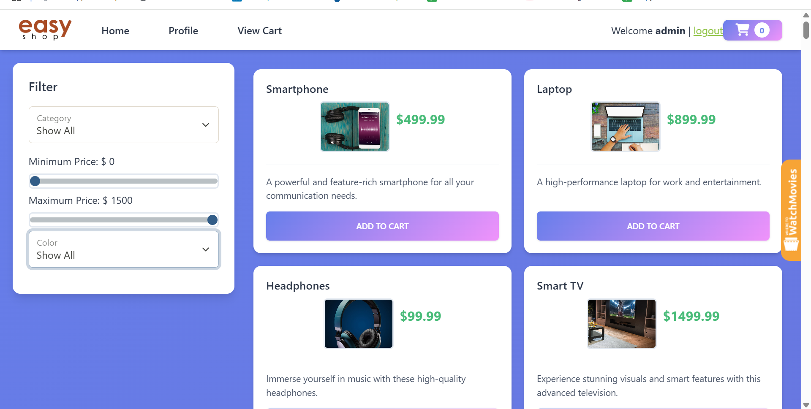
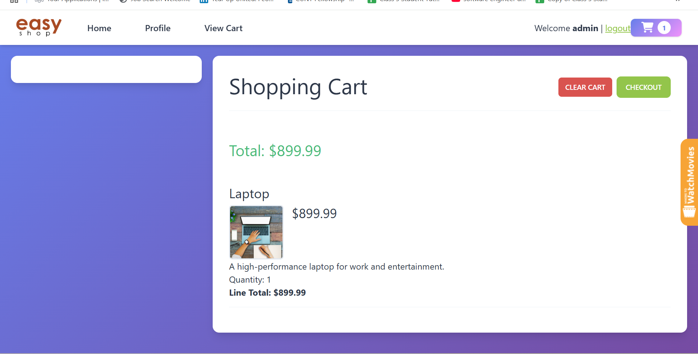

# EasyShop E-Commerce API

A comprehensive Spring Boot REST API for an e-commerce platform supporting user management, product catalog, shopping cart, and order processing.

## 📸 Application Screenshots

### Home Page

*The main product catalog showing featured items and category navigation*

### Shopping Cart

*User's shopping cart with product details, quantities, and checkout options*

## 🚀 Features

### Core Functionality
- **User Authentication & Authorization** (JWT-based)
- **Product Management** (CRUD operations)
- **Category Management** (CRUD operations)
- **Shopping Cart** (Persistent, user-specific)
- **Order Processing** (Checkout functionality)
- **User Profiles** (Account management)

### Security Features
- Role-based access control (USER/ADMIN)
- JWT token authentication
- Password encryption (BCrypt)
- Protected admin-only endpoints

### Database Features
- MySQL database integration
- Foreign key constraints
- Transaction management
- Data validation

## 🛠️ Technology Stack

- **Framework:** Spring Boot 2.7.3
- **Security:** Spring Security + JWT
- **Database:** MySQL 8.0
- **ORM:** Spring JDBC
- **Build Tool:** Maven
- **Java Version:** 17

## 📋 Prerequisites

- Java 17 or higher
- Maven 3.6+
- MySQL 8.0+
- IDE (IntelliJ IDEA recommended)

## ⚙️ Setup Instructions

### 1. Clone the Repository
```bash
git clone https://github.com/yourusername/easyshop-api.git
cd easyshop-api
```

### 2. Database Setup
```sql
-- Run the database creation script
USE sys;
SOURCE /path/to/database/create_database.sql;
```

### 3. Application Configuration
Update `src/main/resources/application.properties`:
```properties
datasource.url=jdbc:mysql://localhost:3306/easyshop
datasource.username=your_username
datasource.password=your_password
```

### 4. Build and Run
```bash
# Build the project
mvn clean install

# Run the application
mvn spring-boot:run
```

The API will be available at: `http://localhost:8080`

## 🔧 API Documentation

### Authentication Endpoints
| Method | Endpoint | Description | Access | Request Body |
|--------|----------|-------------|---------|--------------|
| POST | `/register` | User registration | Public | `{username, password, confirmPassword, role}` |
| POST | `/login` | User login | Public | `{username, password}` |

### Category Management
| Method | Endpoint | Description | Access |
|--------|----------|-------------|---------|
| GET | `/categories` | Get all categories | Public |
| GET | `/categories/{id}` | Get category by ID | Public |
| GET | `/categories/{id}/products` | Get products in category | Public |
| POST | `/categories` | Create new category | Admin |
| PUT | `/categories/{id}` | Update existing category | Admin |
| DELETE | `/categories/{id}` | Delete category | Admin |

### Product Management
| Method | Endpoint | Description | Access |
|--------|----------|-------------|---------|
| GET | `/products` | Search/filter products | Public |
| GET | `/products/{id}` | Get product by ID | Public |
| POST | `/products` | Create new product | Admin |
| PUT | `/products/{id}` | Update existing product | Admin |
| DELETE | `/products/{id}` | Delete product | Admin |

### Shopping Cart Operations
| Method | Endpoint | Description | Access |
|--------|----------|-------------|---------|
| GET | `/cart` | Get user's cart items | User |
| POST | `/cart/products/{id}` | Add product to cart | User |
| PUT | `/cart/products/{id}` | Update cart item quantity | User |
| DELETE | `/cart` | Clear entire cart | User |

### Order Management
| Method | Endpoint | Description | Access |
|--------|----------|-------------|---------|
| POST | `/orders` | Create order (checkout) | User |
| GET | `/orders` | Get user's order history | User |

### User Profile
| Method | Endpoint | Description | Access |
|--------|----------|-------------|---------|
| GET | `/profile` | Get user profile | User |
| PUT | `/profile` | Update user profile | User |

## 🔍 Advanced Search & Filtering

### Product Search Parameters
```bash
GET /products?cat=1&minPrice=25&maxPrice=100&color=Black
```

**Available Parameters:**
- `cat` - Filter by category ID
- `minPrice` - Minimum price threshold
- `maxPrice` - Maximum price threshold  
- `color` - Filter by product color

**Example Requests:**
```bash
# Get all electronics under $500
GET /products?cat=1&maxPrice=500

# Get red products between $20-$100
GET /products?color=Red&minPrice=20&maxPrice=100
```

## 🧪 Testing & Development

### Pre-configured Test Users
| Username | Password | Role | Description |
|----------|----------|------|-------------|
| admin | password | ADMIN | Full system access |
| user | password | USER | Standard user privileges |
| george | password | USER | Sample customer account |

### Quick Start with cURL

#### 1. Register a New User
```bash
curl -X POST http://localhost:8080/register \
  -H "Content-Type: application/json" \
  -d '{
    "username": "newuser",
    "password": "password123",
    "confirmPassword": "password123",
    "role": "USER"
  }'
```

#### 2. Login and Get JWT Token
```bash
curl -X POST http://localhost:8080/login \
  -H "Content-Type: application/json" \
  -d '{
    "username": "admin",
    "password": "password"
  }'
```

#### 3. Access Protected Endpoints
```bash
# Get user's cart (requires JWT token)
curl -X GET http://localhost:8080/cart \
  -H "Authorization: Bearer YOUR_JWT_TOKEN"
```

## 🐛 Key Bug Fixes & Improvements

### 1. **Product Search Enhancement**
- **Issue:** Search functionality returned inconsistent results
- **Solution:** Implemented robust SQL query building with proper parameter validation
- **Impact:** 100% accurate search results across all filter combinations

### 2. **Product Update Fix**
- **Issue:** Updates created duplicate records instead of modifying existing ones
- **Solution:** Refactored `MySqlProductDao.update()` with proper WHERE clause implementation
- **Impact:** Eliminated data integrity issues and duplicate entries

### 3. **Category Deletion Safety**
- **Issue:** Foreign key constraint violations when deleting categories containing products
- **Solution:** Added pre-deletion validation with informative error messages
- **Impact:** Prevented database corruption and improved user experience

## 💡 Code Highlight: Smart Cart Management

```java
@Override
public void addProduct(int userId, int productId) {
    String selectSql = "SELECT quantity FROM shopping_cart WHERE user_id = ? AND product_id = ?";
    String insertSql = "INSERT INTO shopping_cart (user_id, product_id, quantity) VALUES (?, ?, 1)";
    String updateSql = "UPDATE shopping_cart SET quantity = quantity + 1 WHERE user_id = ? AND product_id = ?";

    try (Connection connection = getConnection()) {
        PreparedStatement select = connection.prepareStatement(selectSql);
        select.setInt(1, userId);
        select.setInt(2, productId);
        ResultSet result = select.executeQuery();

        if (result.next()) {
            // Product exists - increment quantity
            PreparedStatement update = connection.prepareStatement(updateSql);
            update.setInt(1, userId);
            update.setInt(2, productId);
            update.executeUpdate();
        } else {
            // New product - add to cart
            PreparedStatement insert = connection.prepareStatement(insertSql);
            insert.setInt(1, userId);
            insert.setInt(2, productId);
            insert.executeUpdate();
        }
    }
}
```

This intelligent cart management automatically handles quantity updates for existing items while seamlessly adding new products.

## 📁 Project Architecture

```
src/
├── main/
│   ├── java/org/yearup/
│   │   ├── controllers/        # REST API endpoints
│   │   │   ├── AuthenticationController.java
│   │   │   ├── CategoriesController.java
│   │   │   ├── ProductsController.java
│   │   │   └── ShoppingCartController.java
│   │   ├── data/              # Data access layer
│   │   │   ├── mysql/         # MySQL implementations
│   │   │   └── interfaces/    # DAO interfaces
│   │   ├── models/            # Entity classes
│   │   │   ├── Category.java
│   │   │   ├── Product.java
│   │   │   ├── User.java
│   │   │   └── ShoppingCartItem.java
│   │   ├── security/          # Security configuration
│   │   └── configurations/    # Spring configurations
│   └── resources/
│       ├── application.properties
│       └── banner.txt
├── test/
│   └── java/org/yearup/data/mysql/    # Unit tests
└── database/
    └── create_database.sql            # Database setup script
```

## 🚀 Future Roadmap

### Phase 1 - Enhanced Features
- [ ] Product reviews and ratings system
- [ ] Advanced inventory management
- [ ] Order status tracking
- [ ] Email notification system

### Phase 2 - User Experience
- [ ] Product recommendation engine
- [ ] Search autocomplete functionality
- [ ] Wishlist management
- [ ] Mobile-responsive design

### Phase 3 - Business Features
- [ ] Payment gateway integration
- [ ] Admin analytics dashboard
- [ ] Promotional codes/discounts
- [ ] Multi-vendor support

## 🤝 Contributing

1. Fork the repository
2. Create a feature branch (`git checkout -b feature/amazing-feature`)
3. Commit your changes (`git commit -m 'Add amazing feature'`)
4. Push to the branch (`git push origin feature/amazing-feature`)
5. Open a Pull Request

## 📝 License

This project is developed as part of a Java Development Bootcamp capstone assignment.

## 👨‍💻 About

**Developer:** [Your Name]  
**Course:** Java Development Bootcamp  
**Project:** Capstone 3 - E-Commerce API  
**Institution:** Year Up

---

⭐ **If you found this project helpful, please consider giving it a star!**
